***
## 解析方針
***

転写効率におけるコアプロモータの重要性  
>> ・コアプロモータを改良することで、従来の高発現プロモータをさらに効率化することができる。 
>> ・コアプロモータは転写開始点を決定することで、転写されるmRNAの配列を決定する。 
>> ・導入遺伝子高発現系を最適化していく場合、1塩基のずれもなく意図した通りにmRNAが転写される必要があるが、コアプロモーターの配列によっては、転写開始点が複数に分散し、意図したものとは異なるmRNAが一定の比率で転写される。 
>> ・従来の高発現プロモーターでは、このように高度な設計が施されることを想定していないため、転写開始点の分散には注意を払う必要がある。 
>> ・そもそも分散型のプロモーターを使用している場合や、本来は収束型であるにも関わらず、発現カセットの操作を行う際に、適切なコアプロモーターを破壊してしまった場合などでは、転写開始点の分散や発現能力の低下が生じる。 

内在性遺伝子の多くは、分散型のコアプロモーター  
>> 収束に関わるコアプロモーター要素を持たない場合や、複数個所に収束に関わるコアプロモーター要素が存在してる場合などでは、基本転写因子群が結合する位置が1か所に限定されないため、認識されうる様々な位置から転写が行われる。 

転写効率が高く、転写開始点が1塩基単位で厳密に収束しているコアプロモータに共通する配列の特徴を探る  
> 参考文献 :  
>> https://bsw3.naist.jp/ko-kato/research.html  

### (1) リード処理
> 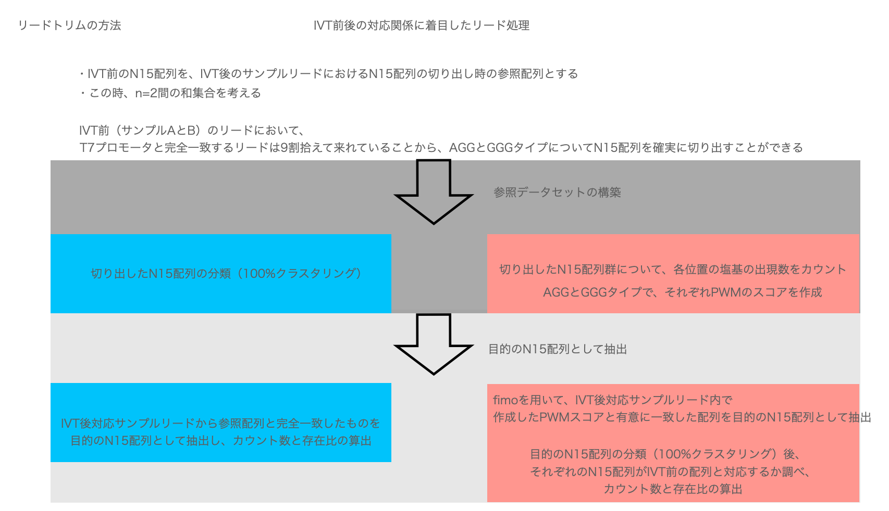  

### (1.5) k-merの範囲の絞り込み
> 5-mer -> 8 merと変化させた時にIVT前後で分布がずれていく様子が観察できれば良い  
> この時、IVT前で正規分布がかけることが前提条件となる  
>> まずは、IVT前でJellyfish countによる最適なk-merを以下の方法で探索  
>> (1) X回出現するユニークなk-mer数の最大値を求める  
>> (2) 異なるk-mer間の最大値同士を比較し、その中でも最大なる時のk-merをベストk-merと定義  
>
> k-merプロファイリングの活用  
>> (1) 配列検索のフィルタリング  
>> (2) de Brujin グラフによるゲノムアセンブリ  
>> (3) 種の判別  
>
> k-mer解析ツール  
>> ・k-merカウントツール：Squeakr  
>> ・kat hist
>> ・jellyfish count、histo
>
> 参考：TFBS長の分布  
>> 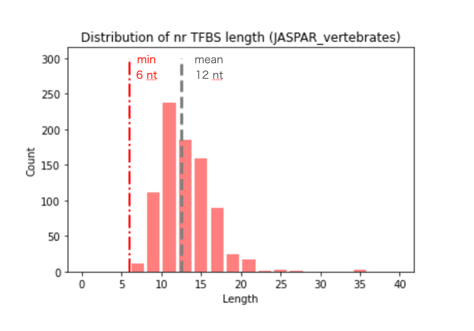
>
> 参考：k-mer頻度の理論分布  
>> ・データセットn=100,000の時  
>> 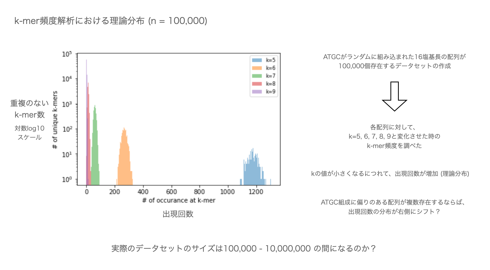  
>> ・データセットn=10,000,000の時  
>> 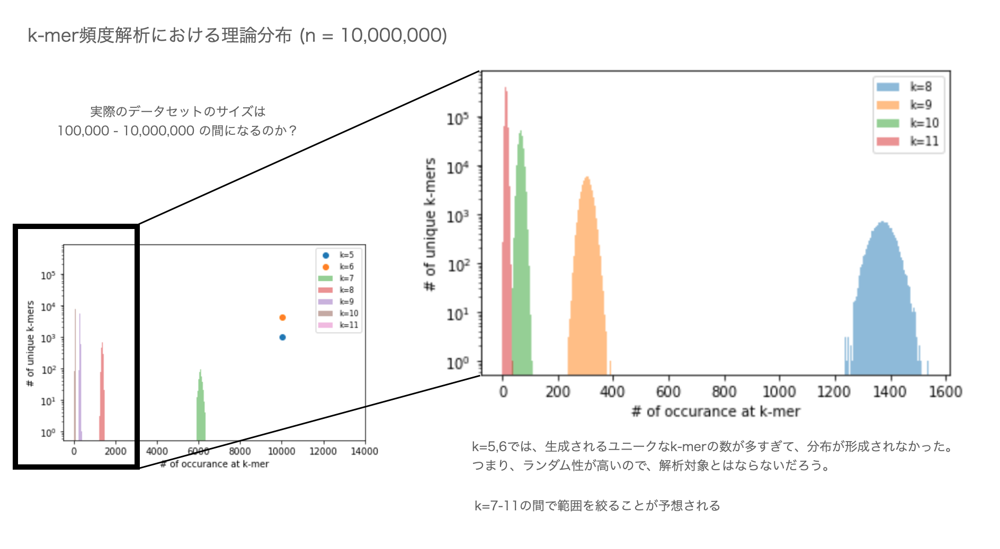  
>
> 参考：目的配列上におけるk-mer配列の出現位置の解析
>> 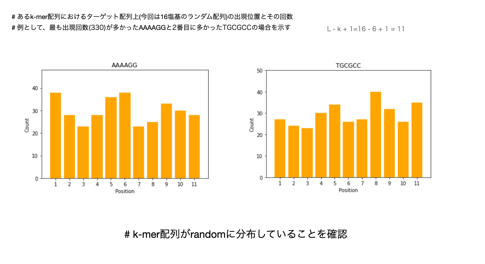

### (2) 目的配列の抽出
> 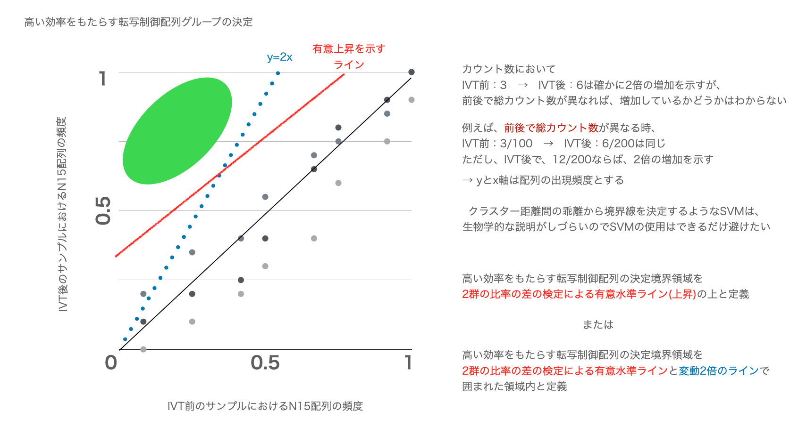  
> 散布図は以下のように修正  
> 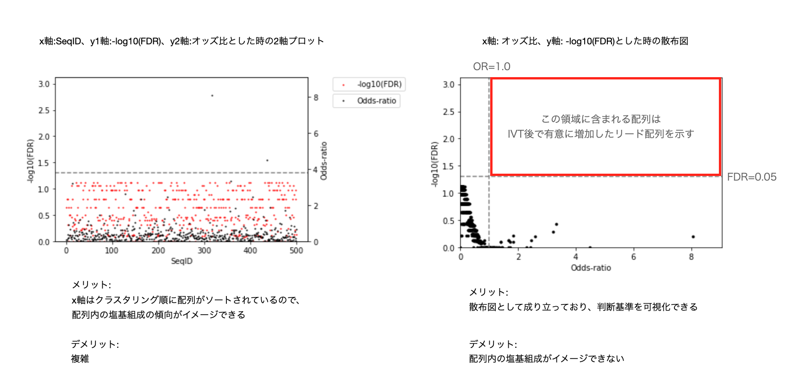  
>
> ライブラリー構造  
> 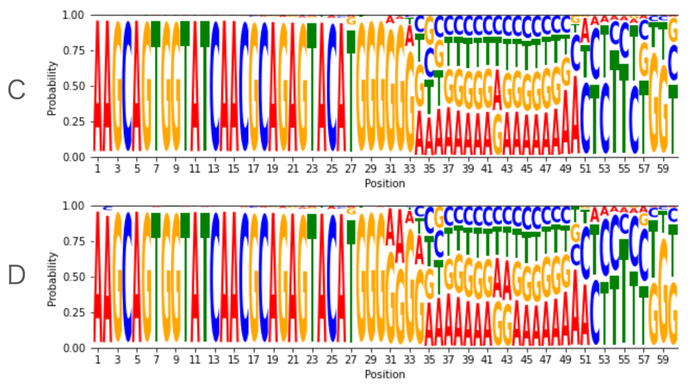  
> 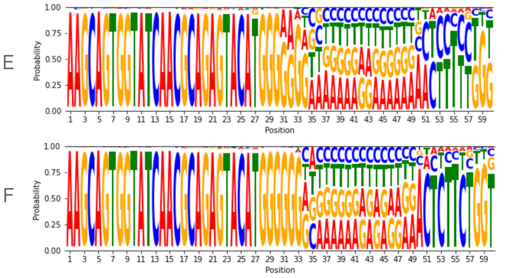  
> 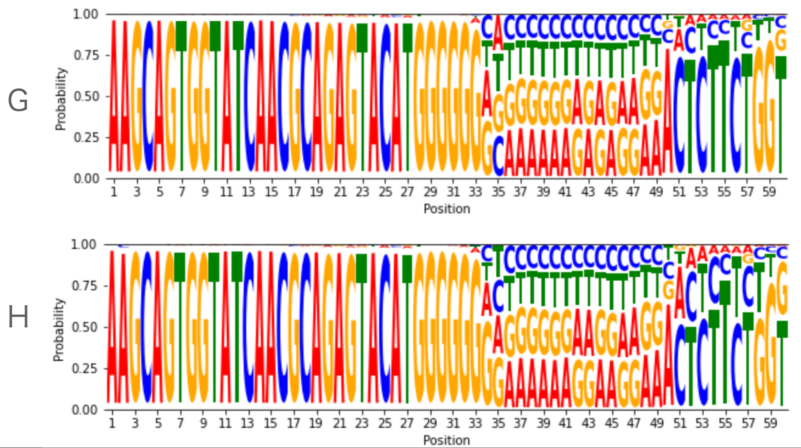  
> 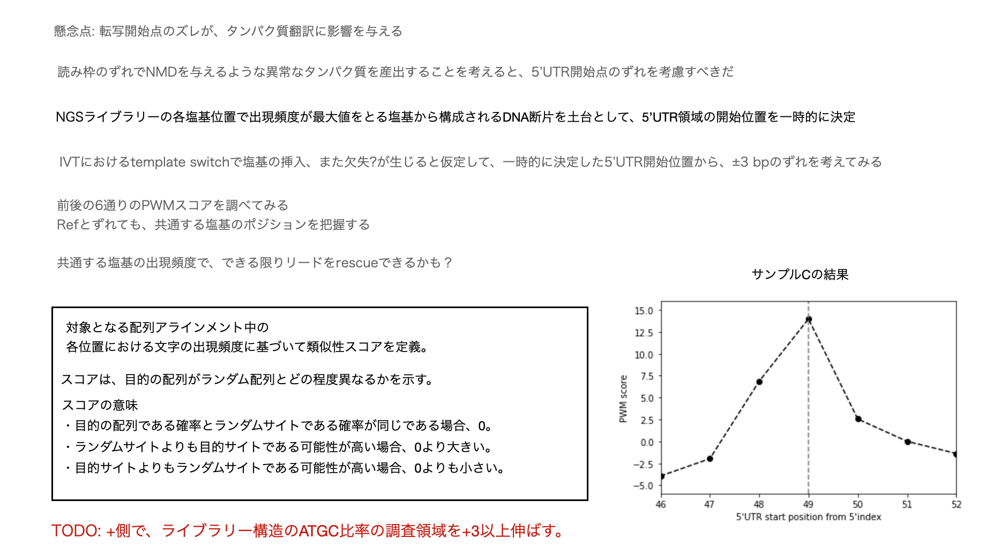  
> 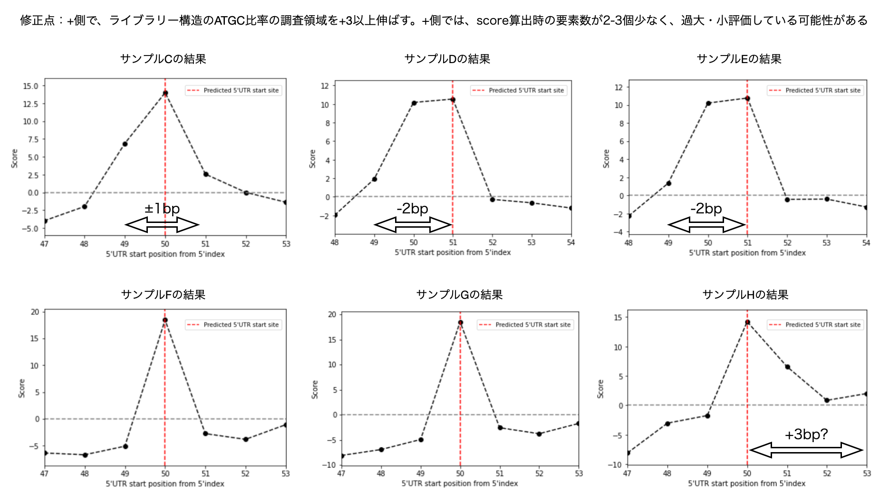  
### (3) 目的配列内のAGCT比率に偏りがある領域の同定
> 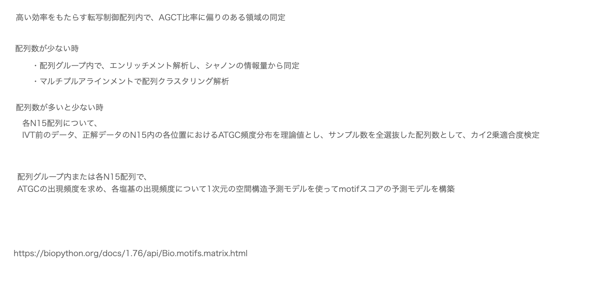  
### 例) デモデータを用いて、各位置におけるAGCT出現頻度の予測
> 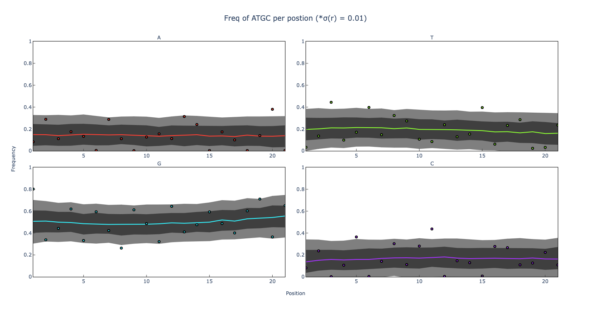  
> 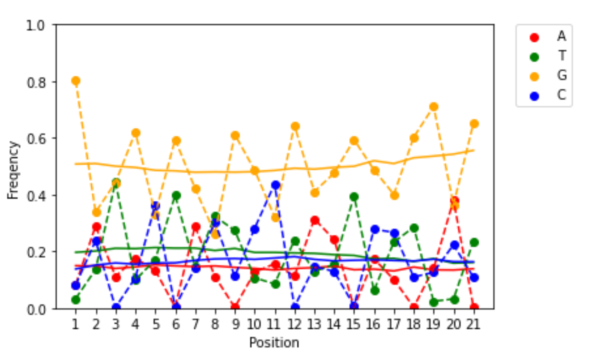  
> 予測値は、ベイズ予測分布の中央値を示す。 
> 中央値は、各位置でATGCの出現頻度の総和が1になることを確認済。  
>  
> 観測結果から、ある21塩基挿入配列にはAGCT比率に偏りのある領域が存在するだろうと仮定して、配列内におけるAGCT比率について、1次元の空間構造モデルで表現した。上のグラフ結果で対象となった配列は、配列内でAGCT比率に偏りがある領域はなく、全ての位置でGが0.5%の確率で出現しやすいことが予想された。 
>  
> このモデルでは、近接領域で応答変数の値に偏りのない、ランダムウォークの状態が見られる時には、グラフは水平線を描く。  
> 逆に、応答変数の値に局所性が見られれば、グラフの概形は激しく変動したものになる。  