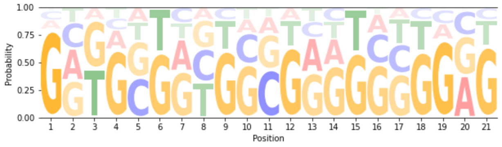
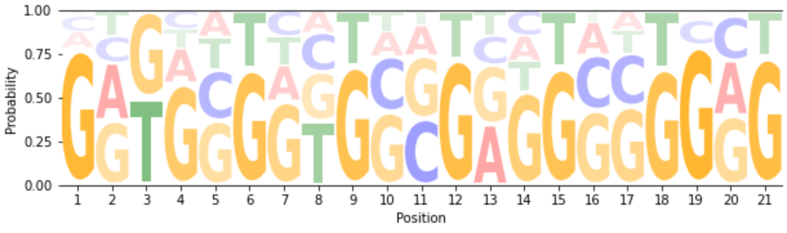
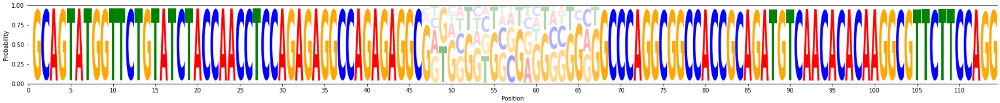
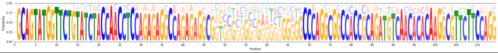
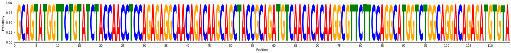
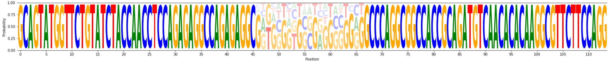
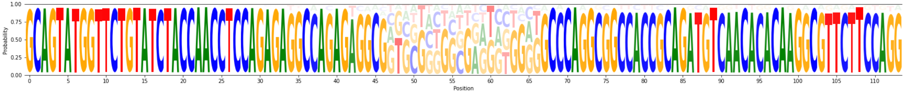
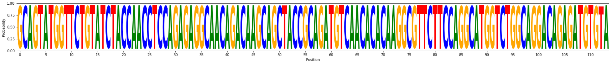

***
## TODOリスト
***

### (1) perfect matchしなかった46塩基のパターン解析　
> → PG4536_12で、配列パターンが大きく2通り考えられる時の解析のことを指す  
> → 結果の可視化には、挿入配列前後の配列も追加 (スクリプト参照)  
> → 存在頻度を出す（生物学的な条件によって使い分けをしていることを考える） 
> → 以下にその解析結果を示す  

> ## ・PG4536_12  
> トリム時にmismatchを許容したリードの処理（=全リードを対象）時の挿入配列21塩基  
>>   
>>
> perfect matchしたリードの処理時の挿入配列21塩基  
>>   
>> -> マイナーパターン(10%)の情報が失われている  
>
> 事前無情報に基づく塩基の頻度  
>> (1) perfect matchしたリードの処理　63328 seqs / 76398 seqs = 0.829  
>>   
>>
>> (2) mismatchを許容したリードの処理  
>> (i) Pattern1 (refとperfectmatch)  5272/13070 = 0.403  →  0.171 x 0.403 = 0.0689 (7%)  
>>   
>>
>> (ii)  Pattern2 (refとmismatch) 7798/13070 = 0.597 → 0.171 x 0.597 = 0.102 (10%) → マイナータイプ ?  
>> 
>>
> 事後確率に基づく塩基の頻度  
>> (1) perfect matchしたリードの処理  63328 seqs / 76398 seqs = 0.829  
>> 
>>
>> (2) mismatchを許容したリードの処理  13070 seqs / 76398 seqs = 0.171  
>> (i) Pattern1 (refとperfectmatch)  5272/13070 = 0.403  →  0.171 x 0.403 = 0.0689 (7%)  
>> 
>>
>> (ii) Pattern2 (refとmismatch) 7798/13070 = 0.597 → 0.171 x 0.597 = 0.102 (10%) → マイナータイプ ?  
>> 
>

### (2) 全12検体の21塩基のクラスタリング
> → 各positionの対数オッズ比の集合体をその塩基配列のスコアとして考える。 
> → それらスコアのばらつきでクラスタリングを組む  
> → 21挿入配列のクラスタリング結果とその左近傍の46塩基のクラスタリング結果は同じになるか？  